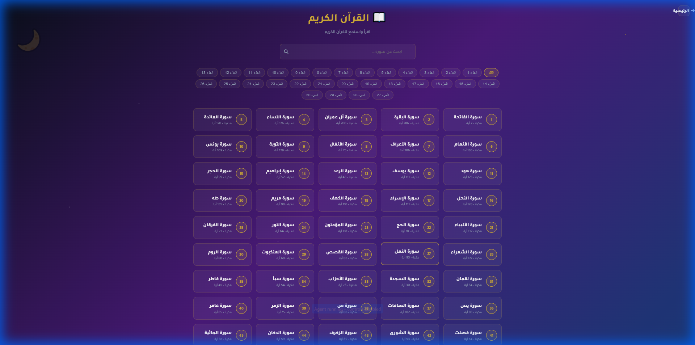
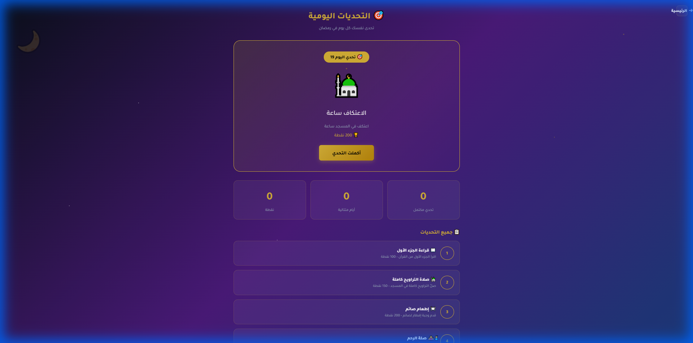

# 🌙✨ رمضانك عندنا 2026 - رفيقك المتكامل في الشهر الكريم ✨🌙

يسعدنا أن نعلن عن إطلاق موقعكم الرمضاني الجديد "رمضانك عندنا"، المنصة الشاملة التي تجمع لكم كل ما تحتاجونه في شهر رمضان المبارك في مكان واحد! 🕌📱

## 🌟 مميزاتنا الجديدة والمتكاملة:

### 🏆 1. المسابقة الرمضانية اليومية
- اختبر معلوماتك الدينية يومياً بسؤال جديد.
- تنافس مع الآخرين واجمع النقاط لتتصدر **لوحة الأوائل**.
- جوائز وتحديات شيقة في انتظارك!

### 📿 2. السبحة الإلكترونية الذكية
- سبحة متطورة مع تتبع لعدد التسبيحات.
- مجموعة من الأذكار المختارة.
- حفظ تلقائي لعدد التسبيحات حتى لا يفوتك شيء.

### 📖 3. المصحف الإلكتروني الشامل
- تصفح القرآن الكريم كاملاً بـ 114 سورة.
- إمكانية الاستماع للتلاوة بصوت عذب.
- واجهة سهلة التصفح ومريحة للعين.

### 🧭 4. اتجاه القبلة
- معرفة دقيقة لاتجاه القبلة أينما كنت باستخدام تقنية GPS.
- بوصلة تفاعلية سهلة الاستخدام.

### 🤲 5. أدعية رمضانية مختارة
- مكتبة شاملة للأدعية:
    - أدعية الإفطار والسحور.
    - أدعية ليلة القدر.
    - أدعية المغفرة والرحمة.
    - أدعية عامة لكل الأوقات.

### 📅 6. جدول ختمة القرآن
- خطط لختم القرآن الكريم في 30 يوماً.
- تتبع تقدمك يومياً بسهولة.
- تنظيم وتوزيع الأجزاء على مدار الشهر.

### 🍽️ 7. وصفات رمضانية شهية
- وصفات متنوعة للإفطار والسحور.
- قسم خاص للحلويات والمشروبات الرمضانية.
- أفكار جديدة كل يوم لمائدتك.

### 📊 8. تتبع العبادات اليومي
- جدول لمتابعة 12 عبادة يومية (الصلاة، الصيام، الصدقة، وغيرها).
- حافظ على حماسك وتنافس مع نفسك في الطاعات.

### 🎯 9. التحديات اليومية
- 30 تحدي يومي متنوع لزيادة همتك.
- اكسب نقاط إضافية عند إتمام التحديات.

### 📺 10. البرامج الرمضانية
- استمتع بمشاهدة سلاسل مختارة مثل "قصص الأنبياء".
- قوائم تشغيل منظمة ومحتوى هادف.

---

## 📸 جولة في الموقع
*(صور توضيحية من داخل الموقع)*

---

## 🚀 انضم إلينا الآن!
لا تفوت فرصة الاستفادة من كل هذه المميزات لتجعل رمضانك هذا العام مميزاً ومليئاً بالطاعات.

🔗 **رابط الموقع:** [أضف الرابط هنا]

#رمضان_كريم #رمضانك_عندنا #مسابقات #قرآن #أذكار #رمضان_2026
